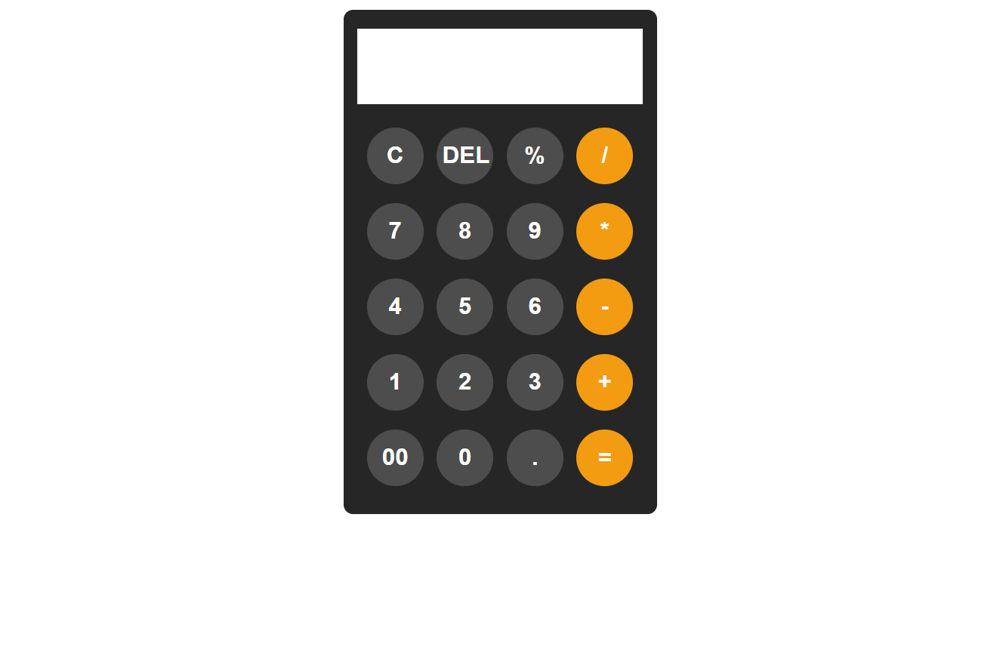

# 🧮 Advanced Calculator


A **simple and modern calculator** built using **HTML, CSS, and JavaScript**.  
It allows you to perform all basic arithmetic operations (`+`, `-`, `*`, `/`) and also supports percentages (`%`).  
Clean design and responsive layout make it easy to use on both desktop and mobile devices.

---

## 🚀 Live Demo
[View Advanced Calculator Live](https://adelsaad99.github.io/Advanced-Calculator/)

---

## ✨ Features
- Basic operations: `+`, `-`, `*`, `/`
- Clear (`C`) and Delete (`DEL`)
- Percentage support (`%`)
- Responsive design (works on desktop and mobile)
- Clean UI with hover effects

---

## 📸 Preview
  


---

## 🛠️ Technologies Used
- **HTML5** → Structure  
- **CSS3** → Styling & Responsiveness  
- **JavaScript (Vanilla JS)** → Functionality  
 

---

## 📂 Project Structure
```bash
Advanced-Calculator/
│
├── index.html       # Main HTML file
├── style.css        # Styling
├── main.js          # Functionality
└── screenshot.png   # Project preview image 
